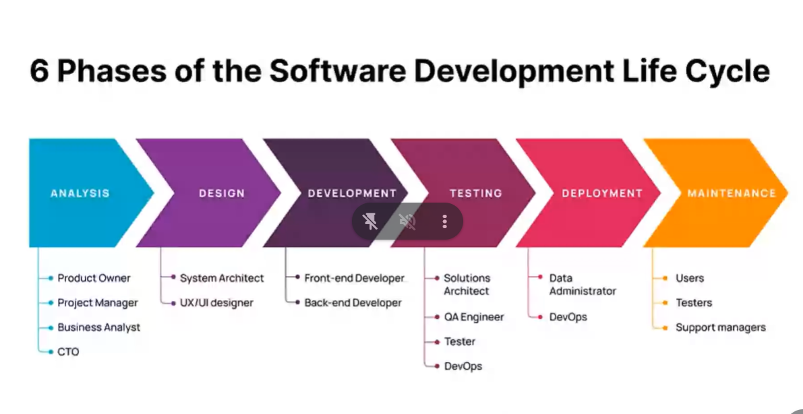
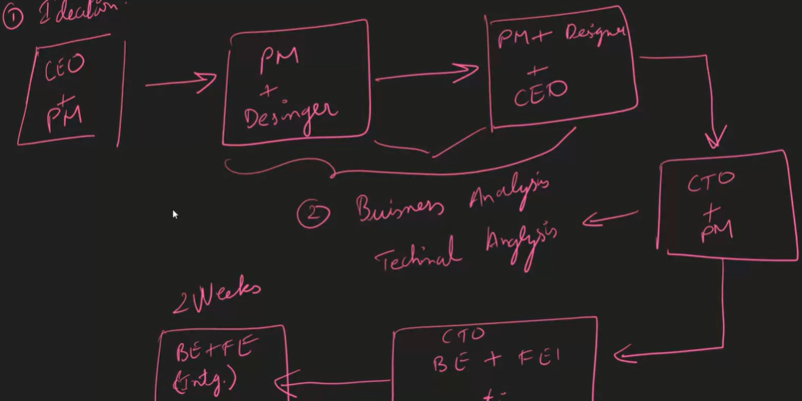
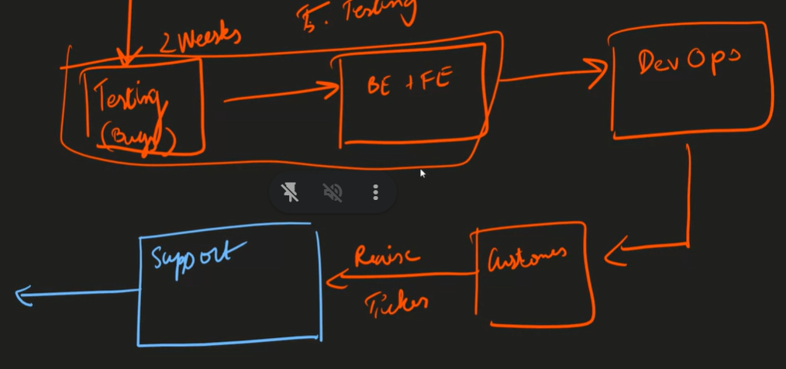
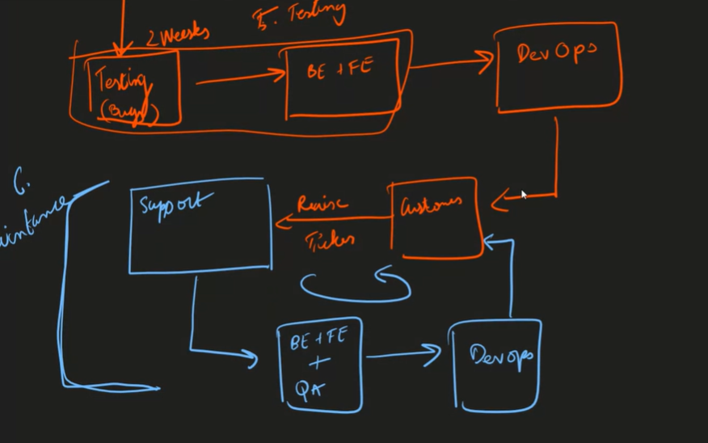
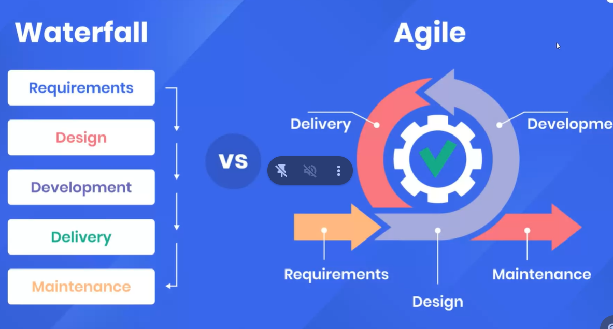
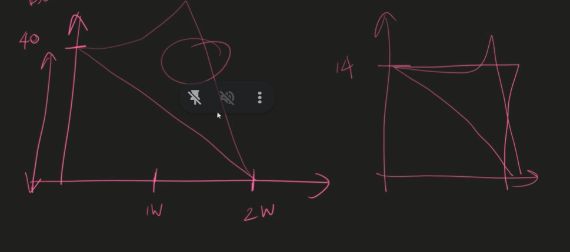

# SDLC - Phases of Software Development LIfe Cycle

1.  Planning - Ideation
2.  Analysis - Business & Technical - whether it is doable or not.
3.  Design - Figma , Adobe , Xd sketcher
    > _Why Design part is necessary?_
    >
    > - It takes less time rather than coding everything.
    > - Those who dont't know how to code they should understand the layout and can give suggestions(everybody will be on same page).
    > - Prototyping is faster.
4.  Implementation - Developers
5.  Testing & Integration
6.  Maintenance - support team

# Stakeholders

- People who are responsible if anything goes wrong.
- Taking the risk
- Eg: Product managers , Team Leads



# System Architect

- The person who initiates the project . (what should be FE and BE , Database and what type of technologies should be used)





# Waterfall Vs Agile



Waterfall Model - yearly 2 --> for every 6 months
Agile - 12 yearly - 2 sprints in a months

 --> Burn down chart

- team or individual performance during the entire period of sprint.

Scrum - agile management tool , imlementation of agile
kanban - tool to manage the scrum , who is assigned to what ticket (task management tool)

Estimates - story points

# Coding standards

Are meant to have uniformity through out your code base

# Variable names

- Understandable / Descriptive

```js
let a=50; ❌
let age = 50;
```

- camelCase

```js
let student_name = "Afrin"; // ❌
let studentName = "Afrin"; ✅
```

### Errors(for variable name)

- Reserved keywords ('if' , 'for')

```js
let if = "Afrin";// ❌
```

Cannot start with numbers

```js
let 2cool = "Afrin";
```

cannot have special symbols ($,@,#,!)(except for'\_')

```js
let abc$123 ="Afrin";// ❌
let abc_123 ="Afrin";✅
```

- choose let over var
- choose const over let

```js
let panCard = "BJR1234"; // ❌
let panCard = "BJR1234"; // ✅
const marks = [10, 20, 30]; //✅
```

--> for readability

```js
const pivalue = 3.14;
const PI_VALUE = 3.14;
```

- Single line comment

```js
//
```

- Multiple comments

```js
/*
 * This is cool
 * Hello
 *
 *
 *
 */
```
