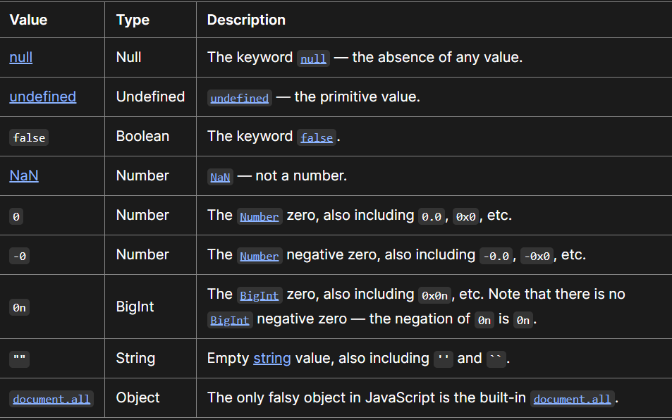

# Object methods

```js
let salaries = {
  Rani: 100,
  Vani: 200,
  Pani: 300,
};

console.log(Object.keys(salaries));
console.log(Object.values(salaries));
```

- output:['Rani', 'Vani', 'Pani']
- output: [100, 200, 300]

ctrl+space--> autocomplete

# Template Literal

- without concatenation we can use interpolation
- for multiple lines
  > _Refractoring :_ Improving the quality but the functionality is same.

# Destructuring

```js
const [t1, t2, t3 = 80] = [100, 200];
console.log(t1, t2, t3);
```

- Unpacking the array one by one - matching the index
- Default value will be taken only when t3 is undefined.

```js
const [t1, t2, t3 = 80] = [100, 200, 500];
```

- Output : t3 is 500 (because t3 is defined here = 500, when there is no value then 80 is taken, if 80 also not there then it is undefined)

# Object Destructuring

based on keys

# Binary operators

- Arithematic +,-,\*,/
- Logical && , ||
- Relational > ,< ,>=,==,===

# Unary Operator

++,--,!

# Ternary operator

```js
5 > 4 ? "Awesome" : "cool";
```

# Truthy vs Falsy

```js
let x="cool";
if(x)
{
    console.log("Hey");
}
else
{
    console.log("Nope);
}
```

> If value converts(cohesion occurs )into true then 'TRUTHY'
> otherwise 'FALSY'


