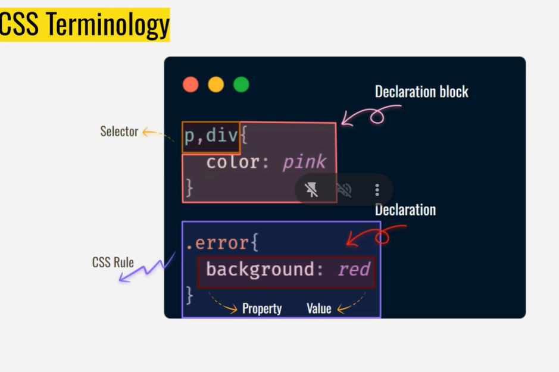
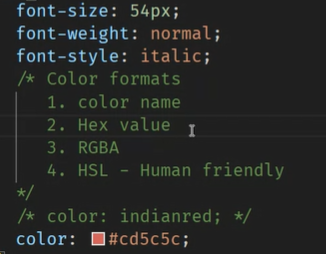
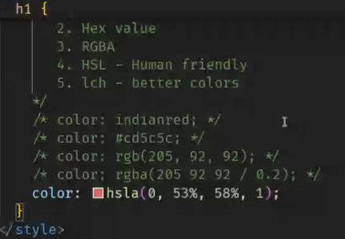
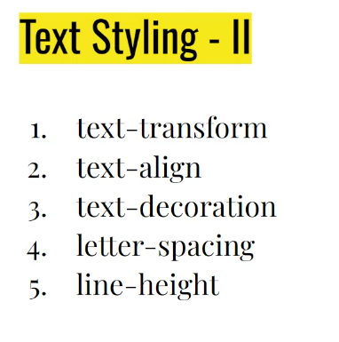
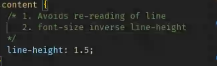

- color gamets:
  > SRGB ,DCPi , AdobesRGB  
  > LCH Supports sRGB  
  > HSL is preferred.

--> People prefer san serif for secure , trustworthy and traditional.

- 1vh=1% of screen height
- 1 vv = 1% of screen width
- width: 1% of container.
- 1px=absolute unit
