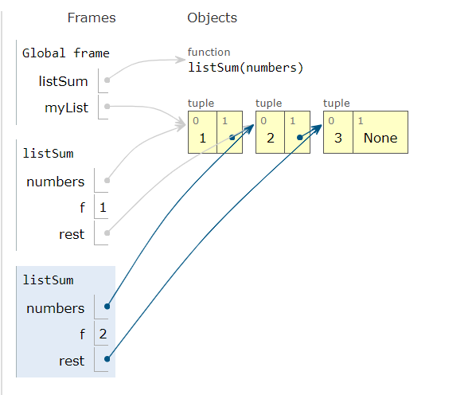

# Intro to web development

Web browser can understand only

- Js
- HTML
- CSS

Even if write in other languages a translator can be used .

1st web browser _Mosaic_

# Browser wars

The war was between _Netscape_ and _IE_.

The war was won by _IE_

Internet explorer was used widely because it was already pre installed.

# WEBSITE ARCHITECTURE

- front end (react , Js)
- Back end (node js , express)
- Date base (mongo DB)

# 3 layers

- React JS
- webpack+Babel(Translator/compiler)
- HTML ,CSS , JS

  > Why 3 layers?
  >
  > - Loose coupling (Even if we change the FE no need of changing the BE)
  > - Platform agnostic (Can talk to other platforms)
  > - Microservices Architecture (It has multiple backends)
  >   Eg: Netflflix

  # Website structure

  - HTML - skeleton
  - CSS - Skin/style
  - Js - Human brain

  > _Brandon Erch_ is the developer of the JS.

  # TC 39

  A group of people will discuss what new features can be added to the Js

  - Stage 0 - Idea
  - Stage 1 - Proposal
  - stage 2 - Draft
  - Stage 3 - Candidate
  - Stage 4 - reading

Console - JS  
Elements - HTML  
Applications - Cookies  
Sources - all thhe files

> what willl happen when we type *www.google.com*

- It works based request and response model.

1. The translation of domain name into the IP address.
2. TCP Connection
3. Sending index.html file (rendering HTML ,CSS)
4. Data is split into packets & travel through multiple paths.
5. Message is reassembled.

- 1991 - HTTP 1 - Separate connections
- 1996 - HTTP 1.1 - 6 Files
- HTTP 1.2 - single connection , if one packet is lost all other packets needs to wait.
- HTTP 2 - Multiplexing over single connection. Even data packet is not transmittted after some time it will be transmittted.

# App Building - CRUD - HTTP Methods

- C - Create - Post
- R - Read - Get
- U - Update - Put
- D - Delete - Delete

# HTTP Status Codes

- 100 - Informational responses
- 200 - Successful responses
- 300 - Redirect responses
- 400 - Client error responses
- 500 - Server error responses

Chrome Engine - V8

- Chrome engine can be in Turbo mode (Certain code running successfully)

> HTML --> HTML Parser --> Document object model (Dom) tree  
> JS ---> JS engine  
> CSS --> Css parser --> CSS OM tree

# Shortcuts

1. windows+. ---> Emojis and symbols
2. ctrl+/ ---> Comment
3. ctrl+, ---> settings

- lang , eng, charset - attributes
- UTF - supports emojis/symbols.

> Chrome , opera , Edge (In 2020)

- Js Engine -V8
- Rendering Engine - Blink
  > Mozilla firefox
- Js Engine -spidermonkey
- Rendering Engine -Gecko

> safari

- Js Engine - Nitro
- Rendering Engine - webkit

> IE , Edge (Before 2020)

- Js Engine -chakra
- Rendering Engine - Trident - IE ,EdgeHTML - Edge

# Data types in Js

1. Boolean
2. Number
3. String
4. Object
5. Null
6. Symbol
7. Bigint
8. Undefined

```js
s = null;
null;
typeof s;
("object");
k;
typeof k;
("undefined");
m = undefined;
undefined;
typeof m;
("undefined");
```

- objects are key values
- type of null is object
- 40/0 = infinity
- when we declare the variable and don't assign the value = undefined
- redeclaring is not allowed let , const vice versa
- reassigning is not allowed only in const  
  
  [Pythontutor.com](https://pythontutor.com/)

[Sqoosh website for image compression](https://squoosh.app/)

> What is an SVG file?
> Scalable Vector Graphics (SVG) is a web-friendly vector file format. As opposed to pixel-based raster files like JPEGs, vector files store images via mathematical formulas based on points and lines on a grid.

1. SVG stands for Scalable Vector Graphics.
2. SVG defines vector-based graphics in XML format.
3. SVG graphics are scalable, and do not lose any quality if they are zoomed or resized.
4. SVG is supported by all major browsers.
5. Based on mathematical formulas

# Scope

Lifetime of a variable

- Tells the area where it is alive otherwise it is dead
- only can access within specified area

> Not defined is a error - not declared at all

> Undefined is a value - declared & value is not assigned

# Typecasting & Cohesion

# Implicit cohesion

- JS automatically typecastes based on priority
  var s1 = 3;  
  var s2 = "6";  
  console.log(s1 + s2); //36  
  console.log(s1 - s2); //-3

# Explicit Cohesion

- User can explicitly change the data type

```js
var s1 = 3;
var s2 = "6";
console.log(s1 +parseInt(s2)); //9
console.log(s1+ +s2); //9

 4 * "5a"
output: NaN

typeof(NaN)
output: number

[1,2,3]+"abc"
output: 1,2,3abc

```

# Which is faster == or === ?

- == allows typecasting/cohesion
  - converts the data types
    > _Note_ :except + operator all other data types will be converted to string
- === does not allow typecasting /cohesion
  - compares directly

# Types of functions

- Normal function
- Arrow function
- Anonymous function
- --> Instead of inline we can add external js files using src and script tag.

# Normal function

```js
//function declaration/definition
//n-parameter
//Function body{}
function double(n) {
  return n * 2;
}

//function call
//arguement - 10
console.log(double(10));
```

# Two ways of existing the functions

- using return
- completes all the statements

# Arrow function

```js
const double = (n) => {
  return n * 2;
};
//remove curly braces and return statement
const double = (n) => n * 2;
```

- DRY = Don't repeat yourself --> Thumb rule

# Why we are using functions?

- code dry (saves time energy)
- Readability
- Modularity
- change in one place everything is changed

# 5 Pillars of Code Quality

1. Readability - 75% - so the other developers can understand in order to apply changes.
2. Maintainability - ❌code debt - want to do tmrw but that tmrw will never come
3. Extensibility - extending
4. Testability - writing the easier test cases
5. Performance - quality is maintained
