# Features

1. Database- frequently data asked it will have it in the ram.
2. Querying becomes easier
3. CRUD-Easy
4. Backups are inbuilt
5. Undo-easily(time limit)
6. Performance.

## Types of Databases

- SQL - Tabular format
  - MySQL ,PostgreSQL , amazon RDS
- NoSQL - Stored in documents
  - mongoDB , CouchDB , redis , cassandra, neo4j , DynamoDB

# Not cloud providers

- Google drive
- Drop box

# Normal Forms

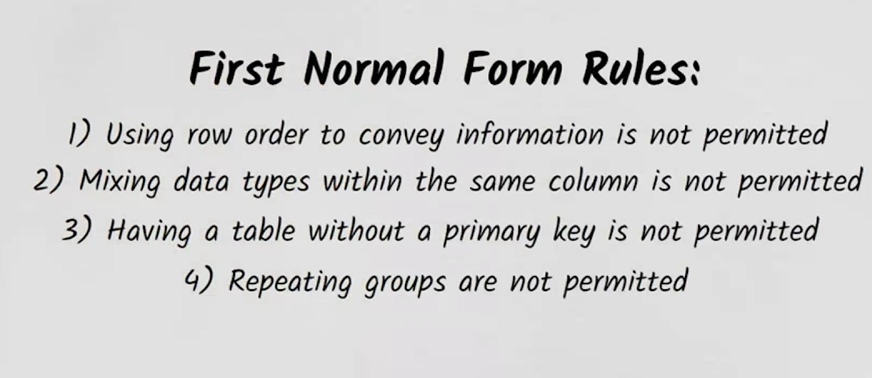

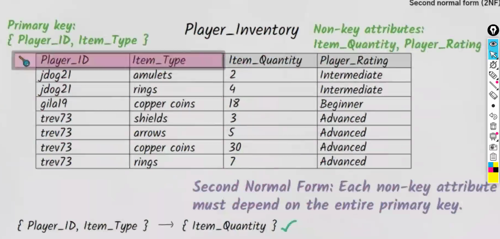

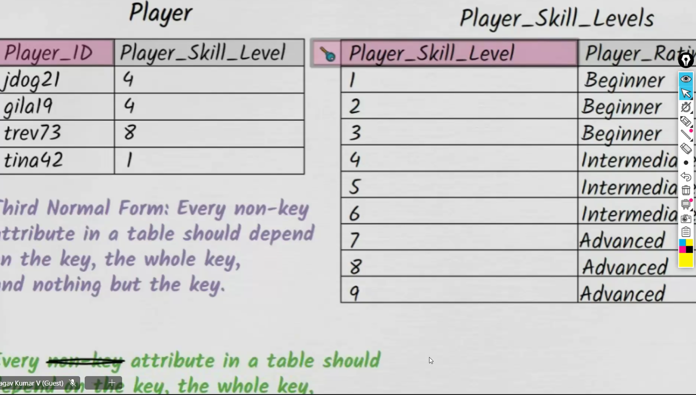

- should not be any dependencies between 2 non key attributes.

# Why group by ?

- Whenever we want to drill down to the next level.

  Now that we have an idea of all the parts of a query, we can now talk about how they all fit together in the context of a complete query.

Complete SELECT query

```sql
SELECT DISTINCT column, AGG_FUNC(column_or_expression), …
FROM mytable
JOIN another_table
ON mytable.column = another_table.column
WHERE constraint_expression
GROUP BY column
HAVING constraint_expression
ORDER BY column ASC/DESC
LIMIT count OFFSET COUNT;
```

- DML (select , update , insert , delete)
- DDL (CRUD)

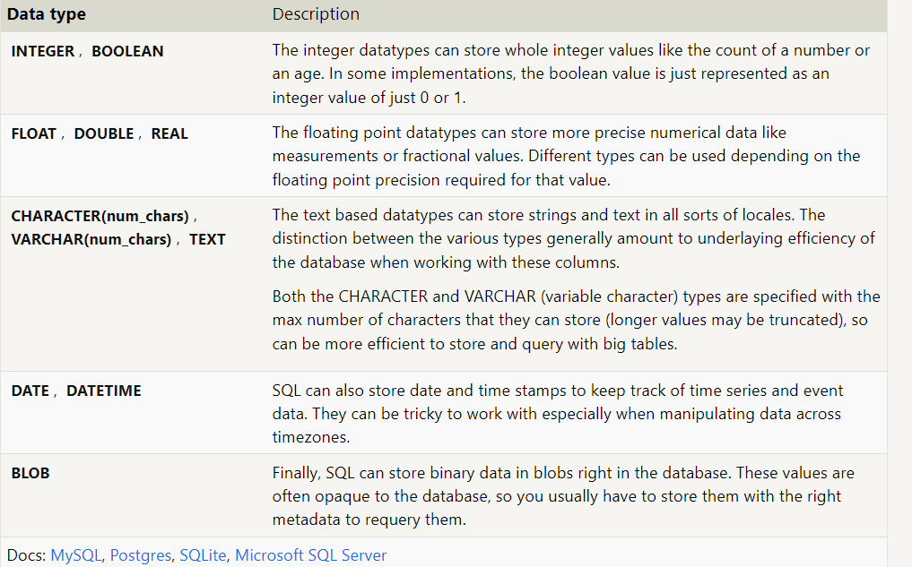

- CHARACTER(num_chars)--> fixed like F or M
- VARCHAR(num_chars)--> Limited to some characters like in LinkedIn description
- TEXT --> paragraph

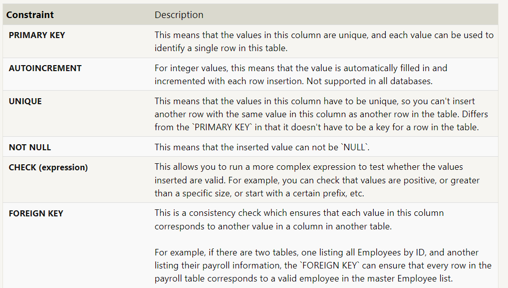

> constraints = validations

# Foreign key constraint

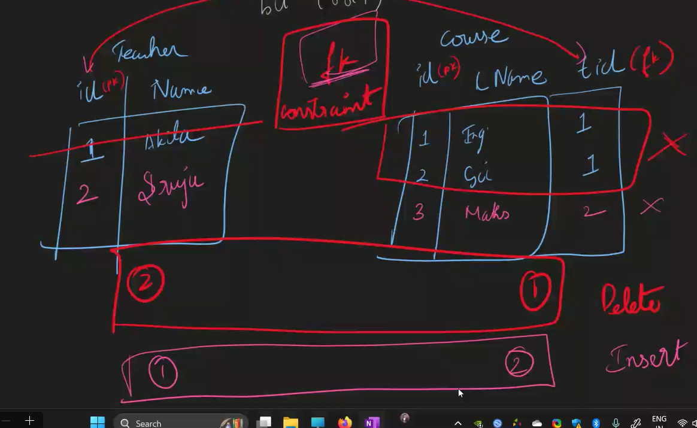


# Diffrence between varchar and nvarchar

- VARCHAR uses a single-byte character set, meaning it can store characters from a single language or script.

- NVARCHAR uses Unicode, allowing it to store characters from multiple languages and scripts.


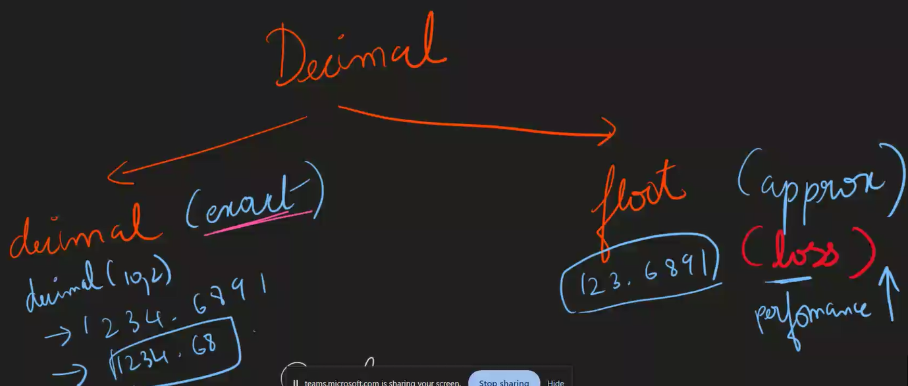


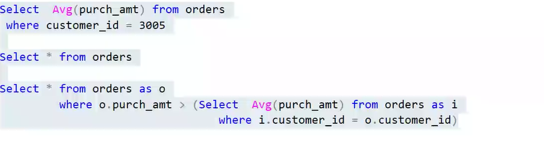
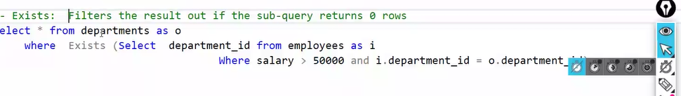
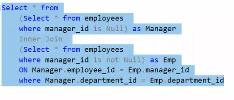
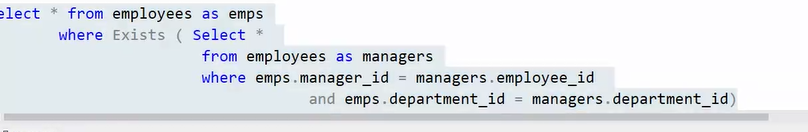

# ER

- Entity : a person or a object
- attributes : columns , describes the entity
