# Exercise 1 — Tasks

1. Find the title of each film

```sql
SELECT Title FROM movies;
```

2. Find the director of each film

```sql
SELECT Director FROM movies;
```

3. Find the title and director of each film

```sql
SELECT Title , Director FROM movies;
```

4. Find the title and year of each film

```sql
SELECT Title , year FROM movies;
```

5. Find all the information about each film

```sql
SELECT * FROM Movies
```

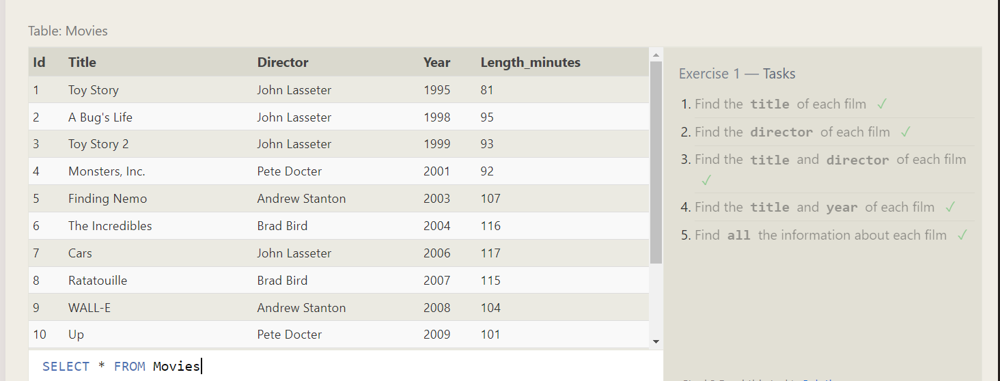

# Exercise 2 — Tasks

1. Find the movie with a row id of 6

```sql
SELECT Title
FROM movies
where id=6;
```

2. Find the movies released in the years between 2000 and 2010

```sql
SELECT Title
FROM movies
where year BETWEEN 2000 AND 2010
```

3. Find the movies not released in the years between 2000 and 2010.

```sql
SELECT Title
FROM movies
where year NOT BETWEEN 2000 AND 2010
```

4. Find the first 5 Pixar movies and their release year

```sql
SELECT title , year
FROM movies
where id BETWEEN 1 AND 5

```

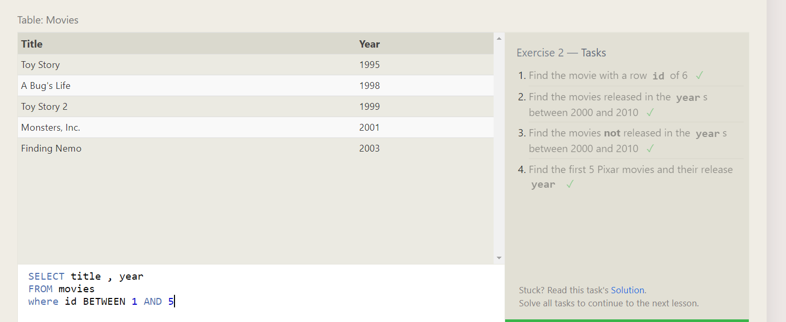

# Exercise 3 — Tasks

1. Find all the Toy Story movies

```sql
SELECT Title
FROM movies
where title LIKE "%Toy%";
```

2. Find all the movies directed by John Lasseter

```sql
SELECT Title
FROM movies
where director="John Lasseter"
```

3. Find all the movies (and director) not directed by John Lasseter

```sql
SELECT Title , director
FROM movies
where director!="John Lasseter"
```

4. Find all the WALL-\* movies

```sql
SELECT TITLE
FROM movies
WHERE TITLE LIKE "%WALL%"
```

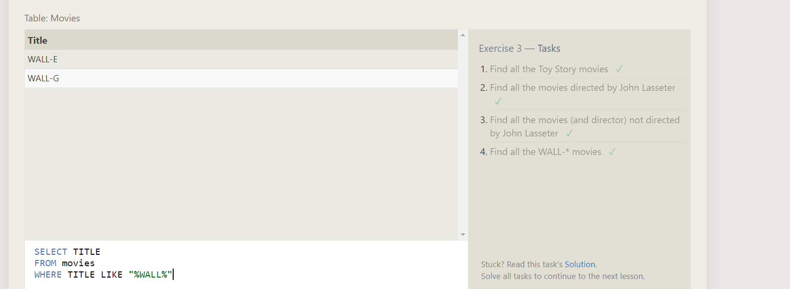

# Exercise 4 — Tasks

1.List all directors of Pixar movies (alphabetically), without duplicates ✓

```sql
SELECT DISTINCT director
FROM movies
ORDER BY director ASC;
```

2. List the last four Pixar movies released (ordered from most recent to least)

```sql
SELECT title
FROM movies
order by year DESC
LIMIT 4
```

3. List the first five Pixar movies sorted alphabetically

```SQL
SELECT title
FROM movies
order by TITLE ASC
LIMIT 5

```

4. List the next five Pixar movies sorted alphabetically

```SQL
SELECT title
FROM movies
order by TITLE ASC
LIMIT 5 OFFSET 5
```

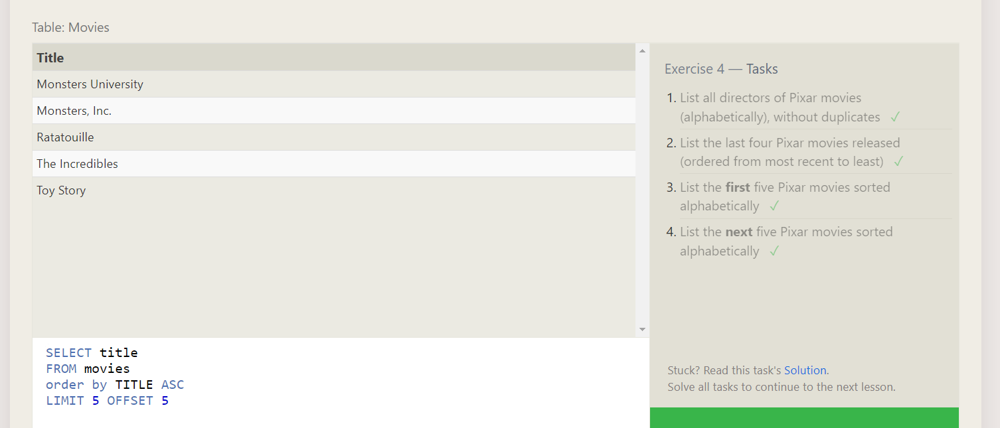

# Exercise 5 — Tasks

1. List all the Canadian cities and their populations ✓

```sql
SELECT City , population
from North_american_cities
where country="Canada";
```

2. Order all the cities in the United States by their latitude from north to south

```sql
SELECT city
from North_american_cities
where country ="United States"
order by latitude desc
```

3. List all the cities west of Chicago, ordered from west to east

```sql
select city
from North_american_cities
where longitude< (select longitude from north_american_cities
where city="Chicago")
order by longitude;
```

4. List the two largest cities in Mexico (by population)

```sql
select city
from North_american_cities
where country="Mexico"
order by population DESC
LIMIT 2
```

5. List the third and fourth largest cities (by population) in the United States and their population

```SQL
select city , population
from North_american_cities
where country="United States"
order by population DESC
LIMIT 2 OFFSET 2
```

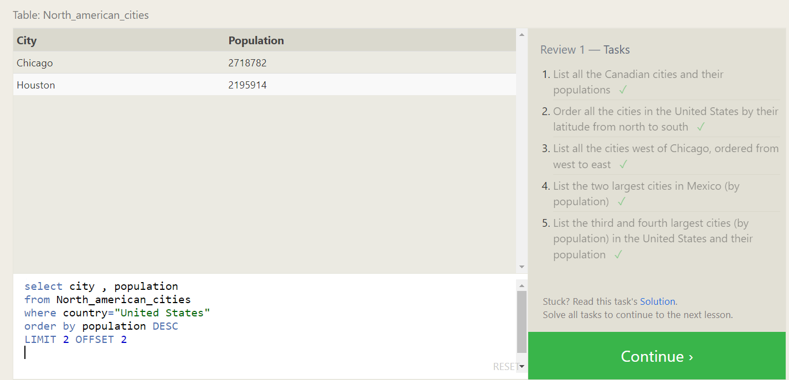

# Exercise 6 — Tasks

1. Find the domestic and international sales for each movie

```sql
SELECT Title,Domestic_sales ,International_sales
FROM Movies
INNER JOIN Boxoffice
on Movies.Id=Boxoffice.Movie_id;
```

2. Show the sales numbers for each movie that did better internationally rather than domestically

```sql
SELECT Title,International_sales , Domestic_sales
FROM Movies
INNER JOIN Boxoffice
on Movies.Id=Boxoffice.Movie_id
where International_sales>Domestic_sales;
```

3. List all the movies by their ratings in descending order

```sql
SELECT Title
FROM Movies
INNER JOIN Boxoffice
on Movies.Id=Boxoffice.Movie_id
order by rating Desc;
```

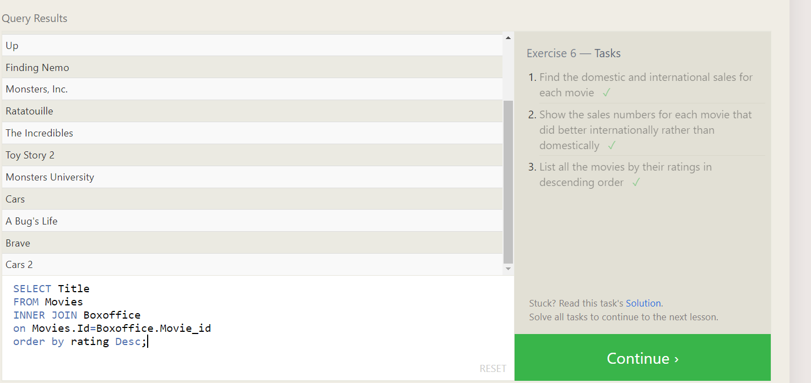

# Exercise 7 — Tasks

1. Find the list of all buildings that have employees

```sql
SELECT Distinct Building
FROM employees

```

2. Find the list of all buildings and their capacity

```sql
SELECT *
FROM Buildings
```

3. List all buildings and the distinct employee roles in each building (including empty buildings)

```sql
SELECT Distinct Building_name , Role
from Buildings
LEFT JOIN Employees
ON Buildings.Building_name=Employees.Building

```

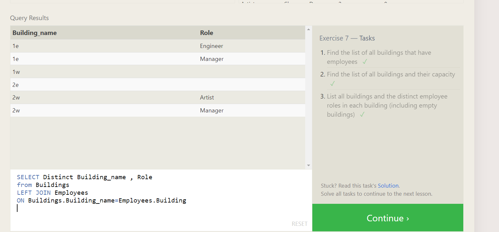

# Exercise 8 — Tasks

1. Find the name and role of all employees who have not been assigned to a building ✓

```sql
SELECT Name , Role
from Employees
where Building is null;
```

2. Find the names of the buildings that hold no employees

```sql
SELECT Building_name
from Buildings
left join Employees
on Building_name=Building
where building is null;
```

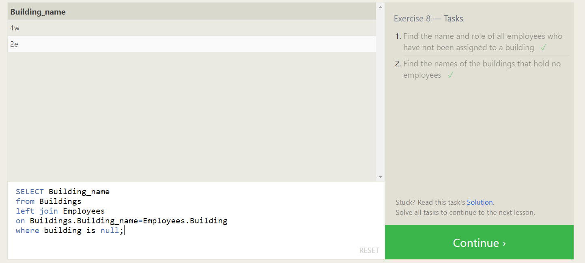

# Exercise 9— Tasks

1. List all movies and their combined sales in millions of dollars

```sql
SELECT title , (Domestic_sales + International_sales)/1000000 as Total_sales
FROM movies
inner join Boxoffice
on Id=Movie_Id;

```

2. List all movies and their ratings in percent

```sql
SELECT title , rating*10
FROM movies
inner join Boxoffice
on Id=Movie_Id;

```

3. List all movies that were released on even number years

```sql

SELECT title
FROM movies
where year%2==0

```

# Exercise 10— Tasks

1. Find the longest time that an employee has been at the studio

```sql
SELECT MAX(Years_employed)
FROM employees;
```

2. For each role, find the average number of years employed by employees in that role

```sql
SELECT Role , Avg(Years_employed)
FROM employees
group by role;

```

3. Find the total number of employee years worked in each building

```sql
SELECT Building , sum(years_employed)
FROM employees
group by building;

```

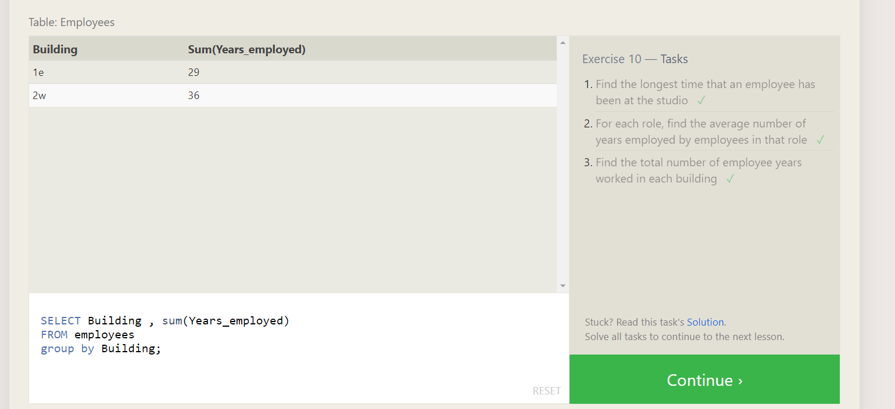

# Exercise 11 — Tasks

1. Find the number of Artists in the studio (without a HAVING clause)

```sql
SELECT count(role)
FROM employees
where role="Artist";
```

2. Find the number of Employees of each role in the studio

```sql
SELECT role ,count(role)
FROM employees
group by role;

```

3. Find the total number of years employed by all Engineers

```sql
SELECT sum(years_employed)
from employees
group by role
having role="Engineer"

```

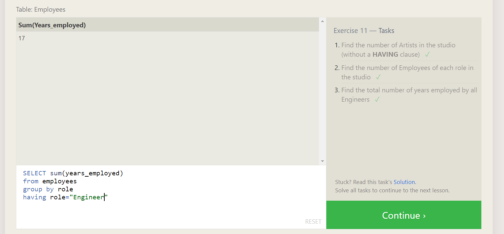

# Exercise 12 — Tasks

1. Find the number of movies each director has directed

```sql
SELECT director , count(title)
FROM movies
group by director
```

Find the total domestic and international sales that can be attributed to each director

```sql
SELECT Director,sum(Domestic_sales+International_sales) as Total_sales
FROM movies
inner join boxoffice
on id = movie_id
group by director

```

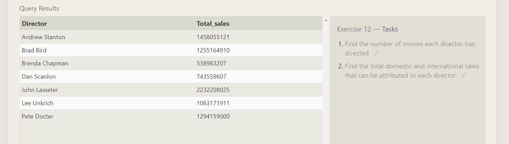

# Exercise 13 — Tasks

1. Add the studio's new production, Toy Story 4 to the list of movies (you can use any director)

```sql
INSERT INTO movies
VALUES (4, 'Toy story 4' ,'Akshya' , 2002 ,100);

```

2. Toy Story 4 has been released to critical acclaim! It had a rating of 8.7, and made 340 million domestically and 270 million internationally. Add the record to the BoxOffice table.

```sql
INSERT INTO Boxoffice
VALUES (4, 8.7 ,340000000 , 270000000);
```

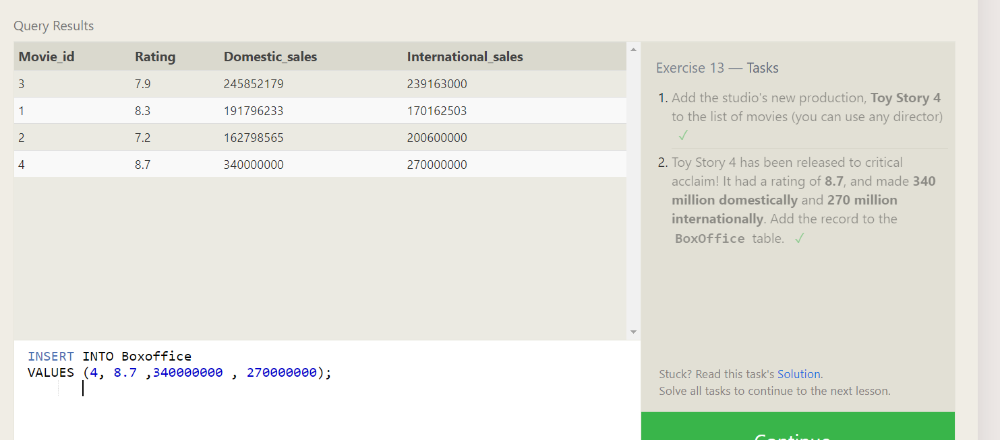

select year
from movies
where id=3

UPDATE movies
SET year= 1999
where id=3

UPDATE Movies
SET Title = "Toy Story 3",
Director = "Lee Unkrich"
WHERE id=11;

1. The director for A Bug's Life is incorrect, it was actually directed by John Lasseter

```sql
select *
from movies
where id=3

UPDATE movies
SET year= 1999
 where id=3

```

2. The year that Toy Story 2 was released is incorrect, it was actually released in 1999 ✓

```sql
select *
from movies
where id=3

UPDATE movies
SET year= 1999
 where id=3
```

3. Both the title and director for Toy Story 8 is incorrect! The title should be "Toy Story 3" and it was directed by Lee Unkrich ✓

```sql

select *
from movies
where id=11


UPDATE Movies
SET Title = "Toy Story 3",
    Director = "Lee Unkrich"
WHERE id=11;
```

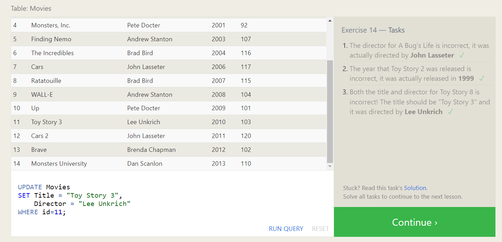

# Exercise 16 — Tasks

1. Create a new table named Database with the following columns:
   – Name A string (text) describing the name of the database
   – Version A number (floating point) of the latest version of this database
   – Download_count An integer count of the number of times this database was downloaded
   This table has no constraints.

```sql
CREATE TABLE Database (
    Name Varchar(50) PRIMARY KEY,
    Version float,
    Download_count int

);
```

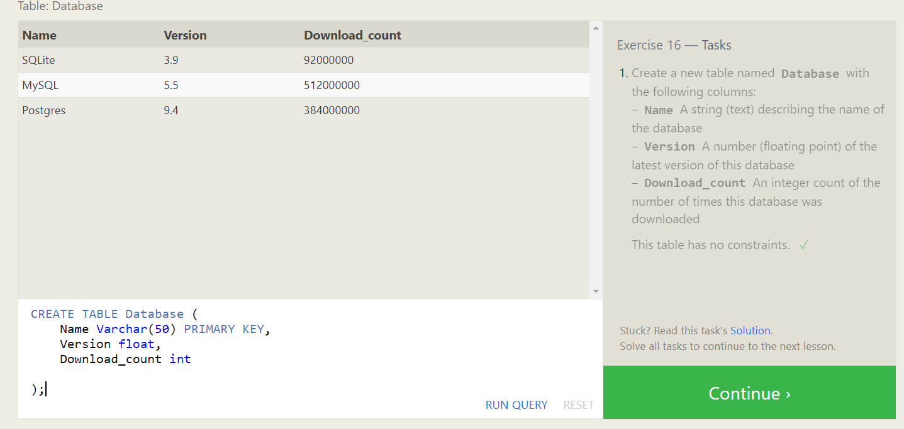

# Exercise 17 — Tasks

1. Add a column named Aspect_ratio with a FLOAT data type to store the aspect-ratio each movie was released in.

```sql
ALTER TABLE movies
ADD  Aspect_ratio float ;
```

2. Add another column named Language with a TEXT data type to store the language that the movie was released in. Ensure that the default for this language is English.

```sql
ALTER TABLE movies
ADD Language text
    DEFAULT English;

```

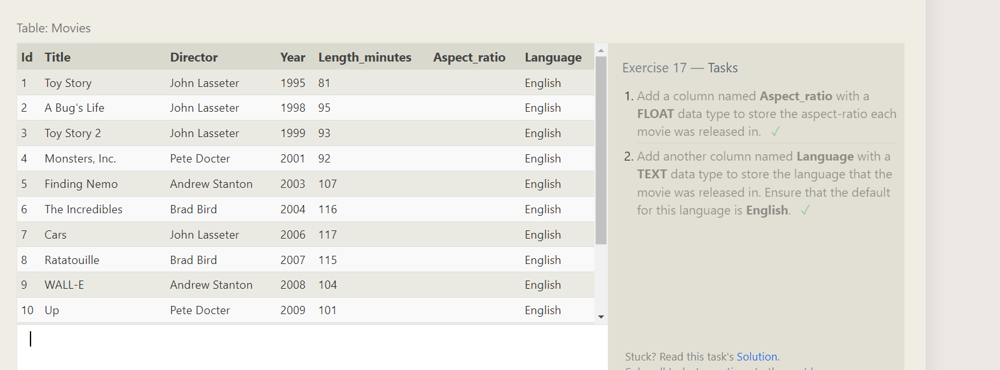

# Exercise 18 — Tasks

1. We've sadly reached the end of our lessons, lets clean up by removing the Movies table.

```sql
DROP TABLE IF EXISTS movies
```

2. And drop the BoxOffice table as well

```sql

DROP TABLE IF EXISTS BoxOffice

```

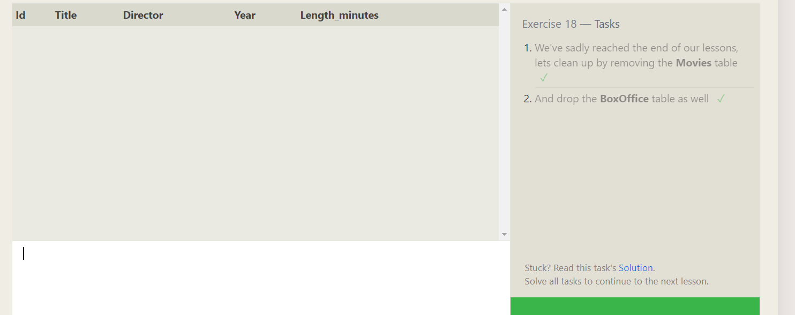

## Task 1

- Find the average commision of a saleman from Paris

```sql
select avg(commission)
from salesman
where city='Paris'
```

## Task 2

- Find out if there are cities with only one salesman and list them | No nulls
  --Clue: Having

```sql
select city
from salesman
group by city
having count(city)=1
```
